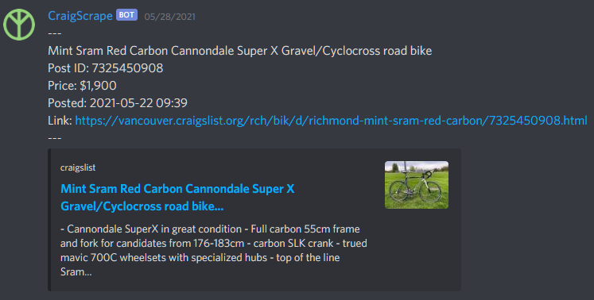
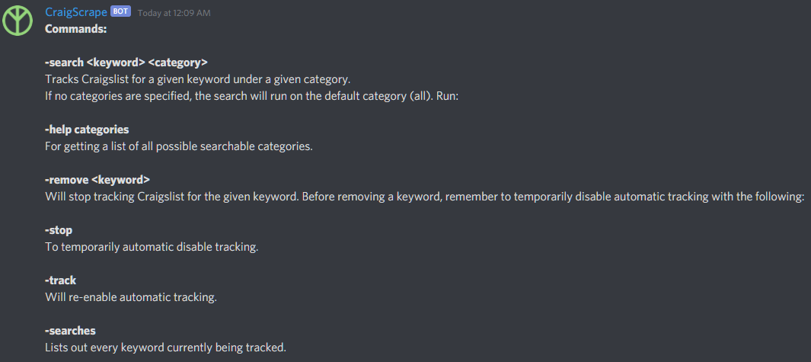

# CraigScrape

---



Never miss a good deal with this web scraping Discord bot which tracks Craigslist!

Built on [discord.py](https://discordpy.readthedocs.io/en/latest/), HTML parsing done via [BeautifulSoup](https://www.crummy.com/software/BeautifulSoup/bs4/doc/).


## Setup:
Clone + fork the repo, then install the required libraries.

After that, go to the .env file. Replace ```<YOUR_TOKEN_HERE>``` in the .env file with your Discord bot's unique token. It should look like this with a token plugged into it (No, this is not a real token):

```TOKEN = 9YHGF43HG4HGF89734JG89JG854```

Then, run ```main.py```. If the console has printed ```<BOTNAME> has connected to Discord.``` then the bot has successfully started.


## Commands:

Run ```-help``` to get a list of commands.

